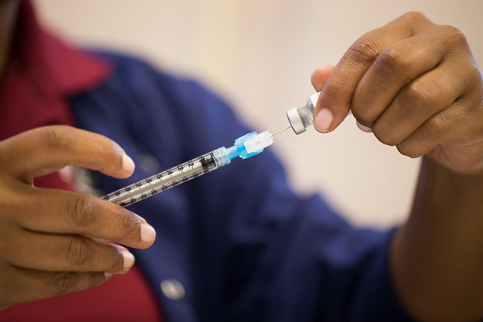
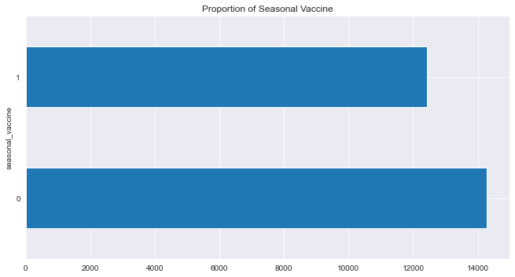
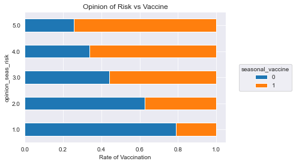
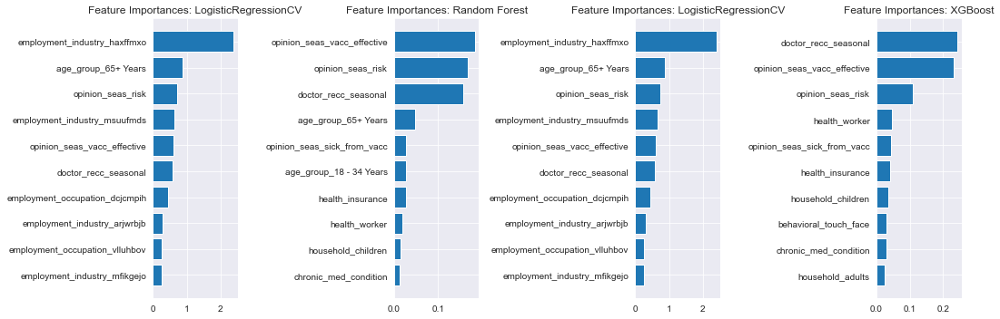

# Flu Shot Learning
## Predicting Seasonal Flu Vaccines 

**Authors**: Robert Cauvy

The contents of this repository detail an analysis of the Phase 3 project. This analysis is detailed in hopes of making the work accessible and replicable.


### Introduction:



As the COVID-19 virus has spread throughout the world. Countries across the world are working to inoculate their populations and protect against future outbreaks. It is essential to know which populations are at risk of not receiving the vaccines. This information would help public health organizations optimally target their resources to informing and educating individuals about the immunizations.

At this stage of the COVID-19 pandemic, new variants has led to a large number of 'break through' cases. Public health officials have stated the best defense against new strains is to get vaccinated and take the recommended booster shots to greatly decrease the risk of hospitalization.

While we don't know what will ultimately unfold, it is likely that we will need to get regular 'booster' shots to protect us from future variants of the virus, much like the seasonal flu vaccine. If we can learn what factors into an individual's choice to receive the seasonal flu vaccine, we can help governments inoculate their constituents.

### Data:
A vaccine for the H1N1 flu virus became publicly available in October 2009. In late 2009 and early 2010, the United States conducted the National 2009 H1N1 Flu Survey. This phone survey asked respondents whether they had received the H1N1 and seasonal flu vaccines, in conjunction with questions about themselves. These additional questions covered their social, economic, and demographic background, opinions on risks of illness and vaccine effectiveness, and behaviors towards mitigating transmission. A better understanding of how these characteristics are associated with personal vaccination patterns can provide guidance for future public health efforts.

We will be using a dataset from Data Driven competition (drivendata.org/competitions/66/flu-shot-learning/data/) that contains data provided courtesy of the United States National Center for Health Statistics, U.S. Department of Health and Human Services (DHHS), National Center for Health Statistics and the National 2009 H1N1 Flu Survey.

The dataset includes approximately 26,707 survey responses relating to the H1N1 and seasonal flu to train various machine learning algorithms in order to predict how likely an individual is to receive a vaccine.

#### Proportion of Vaccine Recipients

> Even balance of vaccinated and unvaccinated.

#### Opinion of Effectiveness vs Vaccine Recipients

> Even balance of vaccinated and unvaccinated.

## Methods
The project was started off with exploratory data analysis (EDA) to understand the relationship between each columns and the target variable. During the EDA phase, it was evident that some columns were missing responses and would need to be addressed.

Next, it become apparent that many columns were categorical and would need to be encoded. This was done through a chain process to use sci-kit learn's OneHotEncoder. 

After encoding the categorical columns. The dataset was ready to be split into training and testing sets and used to train our models. 

The modelling process started with training a baseline dummy classifier model for comparison and continued with training/testing a Logistic Regression model, Decision Tree model, Random Forest model, and an XGBoost model. After initially fitting vanilla models. grid search was used to tune hyperparameter that optimized for the best accuracy scores. Accuracy was choosen as the metric to evaluate model performance because the target variable has a class balance, correctly identifying vaccinated and unvaccinated are equally important to the public health organization's efforts and because accuracy is the most interpretable. 


## Results and Recommendations:

#### Visual 2 Title

> Here are the top features of each of the 4 models. Some of the features were consistent across all 4 models.

In the midst of a pandemic with mutanting and evolving strains, it is vital to keep global populations up to date with immunizations. In order for public health groups to most effectively vaccinate their communities, it is essential to know both what and what does not lead someone to get a seasonal shot.

The most consistent top feature across all 4 models are:

1) A respondent's opinion about risk of getting sick with seasonal flu without vaccine
2) Respondent's opinion about seasonal flu vaccine effectiveness.
3) If the seasonal flu vaccine was recommended by their doctor.

According to the WHO there are about 3 to 5 million cases of severe illness and 290,000 to 650,000 deaths from seasonal flu, worldwide that occur every year. The more the public is aware of this, the more like they are to get vaccinated.

Someone is also more likely to get a shot if they believe it will be effective at protecting them. The more trusted public figures, celebrities, family member speak up about the vaccines effectiveness will only improve society's vaccination rates. The same must also be said for the opposite. Social media platforms must be held accountant for the spread of misinformation.

And lastly, there is a much greater chance of somone getting vaccinated if it was recommnded by their doctor.

Based off these findings Public Health Organizations can prioritize their messaging and actions to improve the likelihood that and individual will receive the flu vaccine.


## Further Review And Analysis

This porject was limisted by the features of this dataset. All of the columns were discrete, categorical variables. I believe the logistic regression and tree based models would have performed much better are predicting vaccines if they had continuous data for some features.

### For further information
Please review the narrative of the analysis in [this jupyter notebook](./Flu_Shot_Learning.ipynb) or review the [presentation](./Phase_3_Project.pdf)

For any additional questions, please contact **rcauvy@gmail.com


##### Repository Structure:


```

├── README.md               <- The top-level README for reviewers of this project
├── Flu_Shot_Learning.ipynb <- Narrative documentation of analysis in jupyter notebook
├── Phase3_Project.pdf      <- pdf version of project presentation
└── images                  <- Both sourced externally and generated from code
└── data                    <- Externally sourced data

```